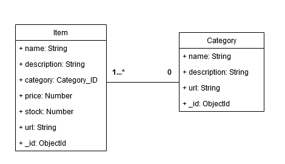

# Inventory Application

The app is a inventory that you can manage your items and categories, create news, update them, or delete it. Can see the list of items for each category.
I created this project mainly to practice full-stack development with a focus in the creation of CRUD app.

# Tech used:
- Javascript
- Node Js
- Express js
- Pug
- MongoDB
- Mongoose

# DB Diagram


# Features:
 - Get all items and categories for the Mongo DB using Mongoose as ORM.
 - Create, update and delete Items.
 - Create, update and delete Categories.
 - View list of all products.
 - View list of items for each category.
 - Schema validation with Mongoose.
 - Server app create with Express js using MVC design pattern.
 - Front end created using pug view engine.

## Prerequisites
 - Nodejs version `v18.16.1` or above.
 - You'll need a running MongoDB instance, either locally or deployed in the cloud. You can deploy one easily following this [documentation](https://www.mongodb.com/docs/atlas/getting-started/).

 ```bash
# Clone this repository
$ git clone https://github.com/LucioFurnari/Inventory-Application.git

# Go into the repository
$ cd Members-Only
```

### Starting the application

```bash
# Go to server directory
$ cd Members-Only

# Install dependencies
$ npm install

# Start app
  # Run Inventory Application on Windows with Command Prompt
  SET DEBUG=inventory-application:* & npm start

  # Run Inventory Application on Windows with PowerShell
  SET DEBUG=inventory-application:* | npm start

  # Run Inventory Application on Linux/macOS
  DEBUG=inventory-application:* npm start
```